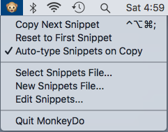

# MonkeyDo

Menulet for simulating typed snippets. Useful for screencasting, live demos, etc.

## Appearance



## Usage

- After launching, import a snippets file (see below) by choosing the `Select Snippets File` menu item.
- Once snippets have been imported, you can use the `Type Next Snippet` menu item or its keyboard shortcut, `^⌥⌘;`, to cause the first snippet to be typed into the frontmost app.
- MonkeyDo will automatically prepare the next snippet
- At any time, you can start over by selecting `Reset to First Snippet` or import another snippets file entirely.

## Snippets file format

The snippets file should be a plaintext file containing chucks of text separated by lines containing five hashes, like so:

```
@IBAction func selectSnippetsMenuItemClicked(_ sender: NSMenuItem) {

}

@IBAction func quitMenuItemClicked(_ sender: NSMenuItem) {
#####
statusItem.title = "🐵"
statusItem.menu = menulet
#####
// Comment says what?
```

Note that if you will be using MonkeyDo with an app that automatically generates code (such as inserting indentation or closing braces as you type), that your snippet should account for the difference.

For example, the first snippet above omits a final closing brace because Xcode would add it by default.

## Known issues

- The global shortcut only works if Dvorak Mode is enabled, and then it works for both QWERTY and Dvorak users.
- The global shortcut doesn't work for users with hardware keyboards where semicolon is in a different location from that of a QWERTY keyboard.
- Multi-byte characters (incl. emoji) in input text don't type correctly.
