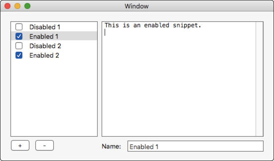

# MonkeyDo

Menulet for simulating typed snippets. Useful for screencasting, live demos, etc.

## Appearance

## Usage

- After launching, import a snippets file (see below) by choosing the `Select Snippets File` menu item.
- Once snippets have been imported, you can use the `Type Next Snippet` menu item or its keyboard shortcut, `^⌥⌘;`, to cause the first snippet to be typed into the frontmost app.
- MonkeyDo will automatically prepare the next enabled snippet
- At any time, you can start over by selecting `Reset to First Snippet` or import another snippets file entirely.
- You can add, delete, toggle, and reorder snippets using the built-in snippet editor.

## Snippets file format

The snippets file is JSON, and is generally automatically managed by MonkeyDo if you use the built-in snippet editor.

If you prefer to create the file manually, there is a [sample file](docs/testsnippets.json).

## Known issues

- Multi-byte characters (incl. emoji) in input text don't type correctly.
- The global shortcut doesn't work for users with hardware keyboards where semicolon is in a different location from that of a QWERTY keyboard.